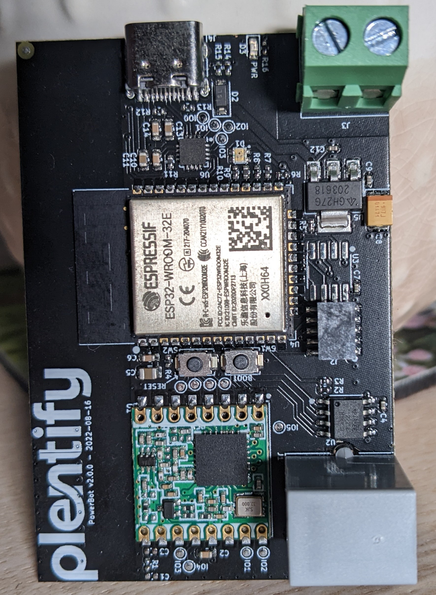

.. _powerbot:

PowerBot
##############

Overview
********

PowerBot is a ESP32 based device that is intended to interface with a Modbus DIN rail electricity meter. The data aquired by the meter can then be used to issue commands the nearby HotBots via the SX1276 and Heatwave protocol.
Data is also posted directly to a database via the WiFi.

Functionality Overview
**********************
PowerBot v2.0.0 hardware consists of the following:
* ESP32-WROOM-32E with 16Mb of on board flash and no included PSRAM
* Optional external PSRAM
* 868MHz SX1276 tranciever on a RFM95W module with a SWRA416 PCB antenna
* SP485ECN RS485 half-duplex tranciever
* ARM 10 pin JTAG header for debugging
* CP2102 USB-UART converter with on board USB-C connector
* Boot and Reset buttons for programming (Boot button doubles as user button)
* IRM-05-02S 5v ACDC converter for powering the board within the distrobution board
* 0606 Diffused RGB LED

